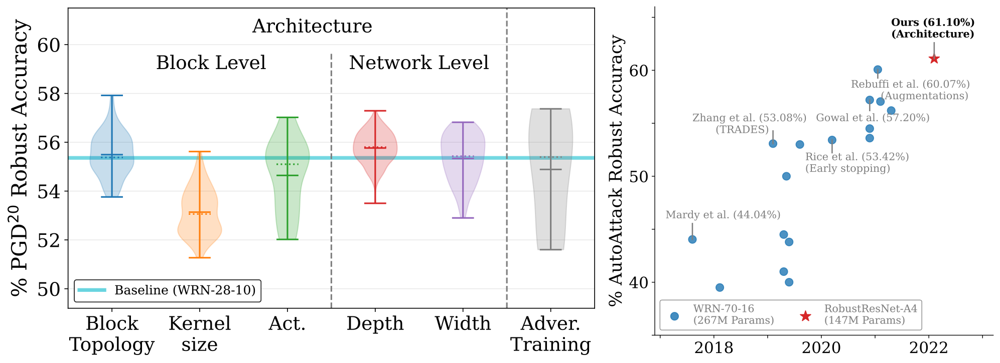
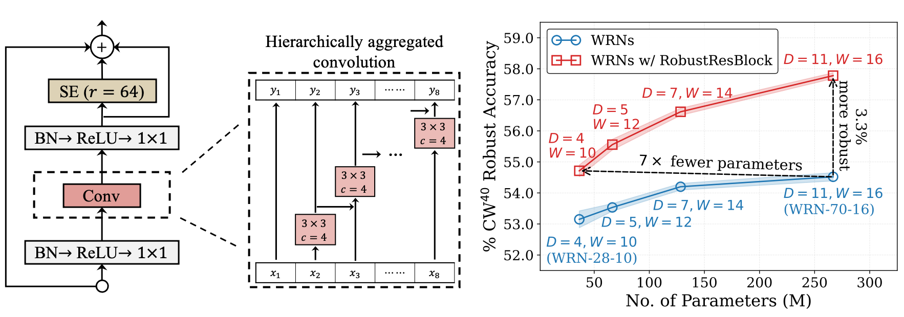
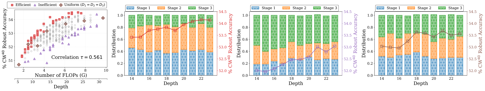
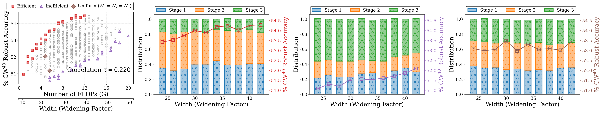
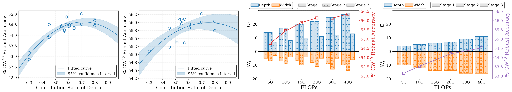
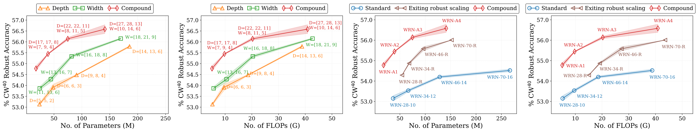

# Revisiting Residual Networks for Adversarial Robustness: An Architectural Perspective [[arXiv]](https://arxiv.org/abs/2212.11005)

## Overview

This work presents a holistic study of the impact of architectural choice on adversarial robustness. 

*(Left)* **Impact of architectural components on adversarial robustness** on CIFAR-10, relative to that of adversarial training methods.
*(Right)* **Progress of SotA robust accuracy against AutoAttack** without additional data on CIFAR-10 with $\ell_{\infty}$ perturbations of $\epsilon=8/255$ chronologically.

### Impact of Block-level Design
The design of a block primarily comprises its topology, type of convolution and kernel size, choice of activation, and normalization. We examine these elements independently through controlled experiments and propose a novel residual block, dubbed *RobustResBlock*, based on our observations. An overview of RobustResBlock is provided below:
<figure>
  
</figure>

#### Table 1. White-box adversarial robustness of WRN with RobustResBlock

|  | $^{\\#}\rm{P}$ | $^{\\#}\rm{F}$ | $\rm{PGD}^{20}$ | $\rm{CW}^{40}$ |  |
|:---:|:---:|:---:|:---:|:---:|:---:|
| $D=4$, $W=10$ | 39.6M | 6.00G | 57.70 | 54.71 | [[BaiduDisk]](https://pan.baidu.com/s/1Yng1A0snNj8rGzML3WStzg?pwd=f3ct) |
| $D=5$, $W=12$ | 70.5M | 10.6G | 58.46 | 55.56 | [[BaiduDisk]](https://pan.baidu.com/s/1FFxvdVxgHpXnBvidGrpDLA?pwd=p9ue) |
| $D=7$, $W=14$ | 133M | 19.6G | 59.41 | 56.62 | [[BaiduDisk]](https://pan.baidu.com/s/1x9-zVQzu0QeXKr19Ce4YOg?pwd=suau) |
| $D=11$, $W=16$ | 270M | 39.3G | 60.48 | 57.78 | [[BaiduDisk]](https://pan.baidu.com/s/1pr7QcWO1uj9GsrvS5ZvIHg?pwd=x9wp) |

### Impact of Network-level Design
#### Independent Scaling by Depth ( $D_{1}$ : $D_2$ : $D_3$ = $2$ : $2$ : $1$ )
We allow the depth of each stage ( $D_{i\in\\{1,2,3\\}}$ ) to vary among $\\{2, 3, 4, 5, 7, 9, 11\\}$, details and pre-trained checkpoints of $7^{3} = 343$ depth settings are available from [here]().  
<figure>
  
</figure>

#### Independent Scaling by Width ( $W_{1}$ : $W_2$ : $W_3$ = $2$ : $2.5$ : $1$ )
We allow the width (in terms of widening factors) of each stage ( $W_{i\in\\{1,2,3\\}}$ ) to vary among $\\{4, 6, 8, 10, 12, 14, 16, 20\\}$, details and pre-trained checkpoints of $8^{3} = 512$ width settings are available from [here](https://pan.baidu.com/s/1oPAzy_lJWdeMSjE7WHxVFw?pwd=wrd2).
<figure>
  
</figure>

#### Interplay between Depth and Width ( $\sum D_{i}$ : $\sum W_{i}$ = $7$ : $3$ )
<figure>
  
</figure>

<figure>
  
</figure>

#### Table 2. Performance of independent scaling ( $D$ or $W$ ) and compound scaling ( $D\\&W$ )

| $^{\\#}\rm{F}$ Target | Scale by | $D_{1}$ | $W_{1}$ | $D_{2}$ | $W_{2}$ | $D_{3}$ | $W_{3}$ | $^{\\#}\rm{P}$ | $^{\\#}\rm{F}$ | $\rm{PGD}^{20}$ | $\rm{CW}^{40}$ |  |
|:---:|:---:|:---:|:---:|:---:|:---:|:---:|:---:|:---:|:---:|:---:|:---:|:---:|
|  | $D$ | 5 | 10 | 5 | 10 | 2 | 10 | 24.0M | 5.25G | 56.05 | 53.14 | [[BaiduDisk]](https://pan.baidu.com/s/1JUie3bQGVgXlzhlJmPQmMA?pwd=n6vf) |
| 5G | $W$ | 4 | 11 | 4 | 13 | 4 | 6 | 24.5M | 5.71G | 56.89 | 53.87 | [[BaiduDisk]](https://pan.baidu.com/s/1RArVv7_uhYPMqB6sZfoyQQ?pwd=we68) |
|  | $D\\&W$ | 14 | 5 | 14 | 7 | 7 | 3 | 17.7M | 5.09G | 57.49 | 54.78 | [BaiduDisk] |
|  | $D$ | 6 | 12 | 6 | 12 | 3 | 12 | 48.5M | 9.59G | 56.42 | 53.91 | [[BaiduDisk]](https://pan.baidu.com/s/1RfIxgVdM0MrhFDMXkCAHpg?pwd=emha) |
| 10G | $W$ | 5 | 13 | 5 | 16 | 5 | 7 | 44.4M | 10.5G | 57.06 | 54.29 | [[BaiduDisk]](https://pan.baidu.com/s/1z1TGW4dre_Ydu5KU7ZqV5A?pwd=7q6s) |
|  | $D\\&W$ | 17 | 7 | 17 | 9 | 8 | 4 | 39.3M | 9.74G | 58.06 | 55.45 | [BaiduDisk] |
|  | $D$ | 9 | 14 | 8 | 14 | 4 | 14 | 90.4M | 18.6G | 57.11 | 54.48 | [[BaiduDisk]](https://pan.baidu.com/s/1mI4NZsqWpbYhZ2DO09MGcA?pwd=udz8) |
| 20G | $W$ | 7 | 16 | 7 | 18 | 7 | 8 | 81.7M | 20.4G | 58.02 | 55.34 | [[BaiduDisk]](https://pan.baidu.com/s/166JdawZX6ZpfpDaVz8a7Fw?pwd=b8yn) |
|  | $D\\&W$ | 22 | 8 | 22 | 11 | 11 | 5 | 74.8M | 20.3G | 58.47 | 56.14 | [BaiduDisk] |
|  | $D$ | 14 | 16 | 13 | 16 | 11 | 16 | 185M | 38.8G | 57.90 | 55.79 | [[BaiduDisk]](https://pan.baidu.com/s/165NMZ5NP54gTBHcQD_IRaQ?pwd=knmk) |
| 40G | $W$ | 11 | 18 | 11 | 21 | 11 | 9 | 170M | 42.7G | 58.48 | 56.15 | [[BaiduDisk]](https://pan.baidu.com/s/18nNGDffrmVoV9waSeCh8uA?pwd=pfph) |
|  | $D\\&W$ | 27 | 10 | 28 | 14 | 13 | 6 | 141M | 40.9G | 58.76 | 56.59 | [BaiduDisk] |

### Adversarially Robust Residual Networks (RobustResNets)
We use the proposed compound scaling rule to scale RobustResBlock and present a portfolio of adversarially robust residual networks.

#### Table 3. Comparison to SotA methods with additional [500K data](https://github.com/yaircarmon/semisup-adv) 
| Method | Model | $^{\\#}\rm{P}$ | $^{\\#}\rm{F}$ | $\rm{AA}$ | |
|---|:---:|:---:|:---:|:---:|:---:|
| [RST](https://arxiv.org/abs/1905.13736) | WRN-28-10 | 36.5M | 5.20G | 59.53 |  |
| [AWP](https://arxiv.org/abs/2004.05884) | WRN-28-10 | 36.5M | 5.20G | 60.04 |  |
| [HAT](https://openreview.net/forum?id=Azh9QBQ4tR7) | WRN-28-10 | 36.5M | 5.20G | 62.50 |  |
| [Gowal et al.](https://arxiv.org/abs/2010.03593) | WRN-28-10 | 36.5M | 5.20G | 62.80 |  |
| [Huang el al.](https://arxiv.org/abs/2110.03825) | WRN-34-R | 68.1M | 19.1G | 62.54 |  |
| Ours | RobustResNet-A1 | 19.2M | 5.11G | 63.70 | [[BaiduDisk]](https://pan.baidu.com/s/1OH2Tqg0Piz3OFCrhV0dVdw?pwd=m53k) |

## How to use 
### 1. Use our *RobustResNets*
```python
  from models.resnet import PreActResNet
  depth = [D1, D2, D3]
  channels = [16, 16*W1, 32*W2, 64*W3]
  block_types = ['robust_res_block', 'robust_res_block', 'robust_res_block']
  
  # Syntax
  model = PreActResNet(
    depth_configs=depth,
    channel_configs=channels,
    block_types=block_types,
    scales=8,
    base_width=10,
    cardinality=4,
    se_reduction=64
    num_classes=10,  # for CIFAR-10/SVHN/MNIST)
  
  # See Table 2 "D&W" rows for D1, D2, D3 and W1, W2, W3, see below for examples
  RobustResNet-A1 = PreActResNet(
    depth_configs=[14, 14, 7],
    channel_configs=[5, 7, 3],
    ...)
  RobustResNet-A2 = PreActResNet(
    depth_configs=[17, 17, 8],
    channel_configs=[7, 9, 4],
    ...)
  RobustResNet-A3 = PreActResNet(
    depth_configs=[22, 22, 11],
    channel_configs=[8, 11, 5],
    ...)
  RobustResNet-A4 = PreActResNet(
    depth_configs=[27, 28, 13],
    channel_configs=[10, 14, 6],
    ...)
  
  # If you prefer to use WRN's block but with our scalings
  WRN-A1 = PreActResNet(
    depth_configs=[14, 14, 7],
    channel_configs=[5, 7, 3],
    block_types = ['basic_block', 'basic_block', 'basic_block']
    ...)
```

### 2. Just want to use our block *RobustResBlock*
```python
  from models.resnet import RobustResBlock
  # See Table 1 above for the performance of RobustResBlock
  block = RobustResBlock(
    in_chs, out_chs,
    kernel_size=3, 
    scales=8, 
    base_width=10, 
    cardinality=4,
    se_reduction=64,
    activation='ReLU', 
    normalization='BatchNorm')
```
### 3. Use our compound scaling rule, *RobustScaling*, to scale your custom models
Please see [``examples/compound_scaling.ipynb``]()

## How to evaluate pre-trained models
- Download the checkpoints, which should contain the following:
  ```
  arch_xxx/
    -arch_xxx.log  # training log
    -arch_xxx.yaml  # configuration file 
    -checkpoints/
      -arch_xxx.pth  # last epoch checkpoint
      -arch_xxx_best.pth  # checkpoint for best robust acc on valid set
  ```
- Run the following lines to evaluate adversarial robustness
```python
  python eval_robustness.py \
    --data "path to data" \
    --config_file_path "path to configuration yaml file" \
    --checkpoint_path "path to checkpoint pth file" \
    --save_path "path to file for logging evaluation" \
    --attack_choice [FGSM/PGD/CW/AA] \
    --num_steps [1/20/40/0] \
    --batch_size 100  # batch size for evaluation, adjust according to your GPU memory
```
### CIFAR-10 (TRADES)
| Model | $^{\\#}\rm{P}$  | $^{\\#}\rm{F}$ | Clean | $\rm{PGD}^{20}$ | $\rm{CW}^{40}$ | AA |  |
|---|:---:|:---:|:---:|:---:|:---:|:---:|:---:|
| WRN-28-10 | 36.5M | 5.20G | 84.62 | 55.90 | 53.15 | 51.66 | [BaiduDisk] |
| RobNet-large-v2 | 33.3M | 5.10G | 84.57 | 52.79 | 48.94 | 47.48 | [BaiduDisk] |
| AdvRush | 32.6M | 4.97G | 84.95 | 56.99 | 53.27 | 52.90 | [BaiduDisk] |
| RACL | 32.5M | 4.93G | 83.91 | 55.98 | 53.22 | 51.37 | [BaiduDisk] |
| **RRN-A1 (ours)** | 19.2M | 5.11G | 85.46 | 58.47 | 55.72 | 54.42 | [BaiduDisk] |
| WRN-34-12 | 66.5M | 9.60G | 84.93 | 56.01 | 53.53 | 51.97 | [BaiduDisk] |
| WRN-34-R | 68.1M | 19.1G | 85.80 | 57.35 | 54.77 | 53.23 | [BaiduDisk] |
| **RRN-A2 (ours)** | 39.0M | 10.8G | 85.80 | 59.72 | 56.74 | 55.49 | [BaiduDisk] |
| WRN-46-14 | 128M | 18.6G | 85.22 | 56.37 | 54.19 | 52.63 | [BaiduDisk] |
| **RRN-A3 (ours)** | 75.9M | 19.9G | 86.79 | 60.10 | 57.29 | 55.84 | [BaiduDisk] |
| WRN-70-16 | 267M | 38.8G | 85.51 | 56.78 | 54.52 | 52.80 | [BaiduDisk] |
| **RRN-A4 (ours)** | 147M | 39.4G | 87.10 | 60.26 | 57.90 | 56.29 | [BaiduDisk] |

### CIFAR-100 (TRADES)
| Model | $^{\\#}\rm{P}$  | $^{\\#}\rm{F}$ | Clean | $\rm{PGD}^{20}$ | $\rm{CW}^{40}$ | AA |  |
|---|:---:|:---:|:---:|:---:|:---:|:---:|:---:|
| WRN-28-10 | 36.5M | 5.20G | 56.30 | 29.91 | 26.22 | 25.26 | [BaiduDisk] |
| RobNet-large-v2 | 33.3M | 5.10G | 55.27 | 29.23 | 24.63 | 23.69 | [BaiduDisk] |
| AdvRush | 32.6M | 4.97G | 56.40 | 30.40 | 26.16 | 25.27| [BaiduDisk] |
| RACL | 32.5M | 4.93G | 56.09 | 30.38 | 26.65 | 25.65 | [BaiduDisk] |
| **RRN-A1 (ours)** | 19.2M | 5.11G | 59.34 | 32.70 | 27.76 | 26.75 | [BaiduDisk] |
| WRN-34-12 | 66.5M | 9.60G | 56.08 | 29.87 | 26.51 | 25.47 | [BaiduDisk] |
| WRN-34-R | 68.1M | 19.1G | 58.78 | 31.17 | 27.33 | 26.31 | [BaiduDisk] |
| **RRN-A2 (ours)** | 39.0M | 10.8G | 59.38 | 33.00 | 28.71 | 27.68 | [BaiduDisk] |
| WRN-46-14 | 128M | 18.6G | 56.78 | 30.03 | 27.27 | 26.28 | [BaiduDisk] |
| **RRN-A3 (ours)** | 75.9M | 19.9G | 60.16 | 33.59 | 29.58 | 28.48 | [BaiduDisk] |
| WRN-70-16 | 267M | 38.8G | 56.93 | 29.76 | 27.20 | 26.12 | [BaiduDisk] |
| **RRN-A4 (ours)** | 147M | 39.4G | 61.66 | 34.25 | 30.04 | 29.00 | [BaiduDisk] |

### CIFAR-10 (SAT)
| Model | $^{\\#}\rm{P}$ | $^{\\#}\rm{F}$ | $\rm{PGD}^{20}$ | $\rm{CW}^{40}$ |  |
|---|---|---|---|---|---|
| WRN-28-10 | 36.5M | 5.20G | 52.44 | 50.97 | [BaiduDisk] |
| **RRN-A1 (ours)** | 19.2M | 5.11G | 57.62 | 56.06 | [BaiduDisk] |
| WRN-34-12 | 66.5M | 9.60G | 52.85 | 51.36 | [BaiduDisk] |
| **RRN-A2 (ours)** | 39.0M | 10.8G | 58.39 | 56.99 | [BaiduDisk] |
| WRN-46-14 | 128M | 18.6G | 53.67 | 52.95 | [BaiduDisk] |
| **RRN-A3 (ours)** | 75.9M | 19.9G | 58.81 | 57.60 | [BaiduDisk] |
| WRN-70-16 | 267M | 38.8G | 54.12 | 50.52 | [BaiduDisk] |
| **RRN-A4 (ours)** | 147M | 39.4G | 59.01 | 57.85 | [BaiduDisk] |

### CIFAR-10 (MART)
| Model | $^{\\#}\rm{P}$ | $^{\\#}\rm{F}$ | $\rm{PGD}^{20}$ | $\rm{CW}^{40}$ |  |
|---|---|---|---|---|---|
| WRN-28-10 | 36.5M | 5.20G | 57.69 | 52.88 | [BaiduDisk] |
| **RRN-A1 (ours)** | 19.2M | 5.11G | 59.34 | 54.42 | [BaiduDisk] |
| WRN-34-12 | 66.5M | 9.60G | 57.40 | 53.11 | [BaiduDisk] |
| **RRN-A2 (ours)** | 39.0M | 10.8G | 60.33 | 55.51 | [BaiduDisk] |
| WRN-46-14 | 128M | 18.6G | 58.43 | 54.32 | [BaiduDisk] |
| **RRN-A3 (ours)** | 75.9M | 19.9G | 60.95 | 56.52 | [BaiduDisk] |
| WRN-70-16 | 267M | 38.8G | 58.15 | 54.37 | [BaiduDisk] |
| **RRN-A4 (ours)** | 147M | 39.4G | 61.88 | 57.55 | [BaiduDisk] |

## How to train

## Requirements


### Part of the code is based on the following repos:
  - RobustWRN: https://github.com/HanxunH/RobustWRN
  - MART: https://github.com/YisenWang/MART
  - TREADES: https://github.com/yaodongyu/TRADES
  - RST: https://github.com/yaircarmon/semisup-adv
  - AutoAttack: https://github.com/fra31/auto-attack
